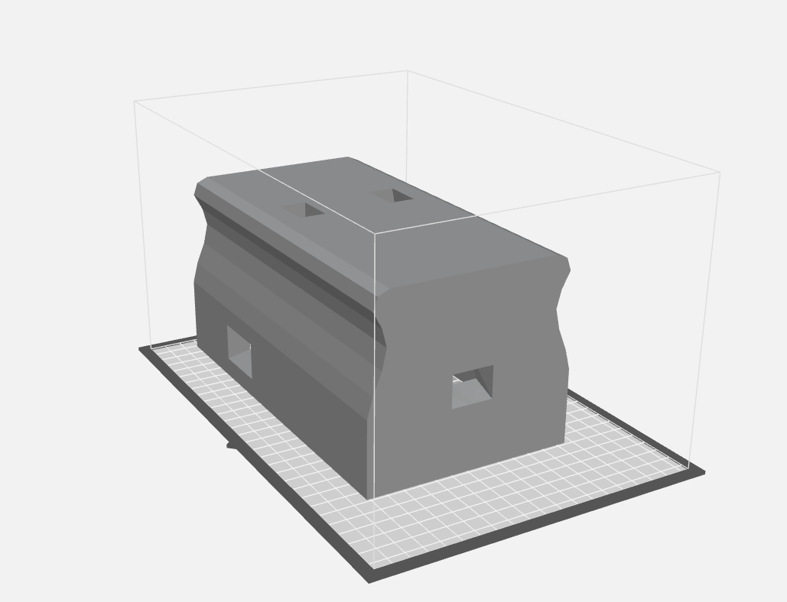

## Agricultural Data Collection "ROWBOT"

**Project description:** This project was funded by the entomology department at the University of Nebraska Lincoln Panhandle Research and Education Center. The goal of this project was to develop a robotics platform that could navigate through a row of crops autonomously and collect data. Originally, two other people were working alongside me on this project, Joseph who was a computer science major like me, and Weizhen, a postdoc working on image analysis. However, after about two months, I was the only one working directly on the project. The most difficult part of this project was the algorithm to find the center of the crop, the "vanishing point". We had planned a few programs that were inconsistent in their problem solving. The solution my colleague, Joseph, had was to isolate the plant pixels and find the vanishing point based on the column. Meanwhile, I was working on code to smooth the isolated green pixels in order to find an average of the point. We combined these two to create a program that could consistently track and react to a vanishing point. 

**An example of the program blending the image**

After figuring out this tracking, I was the main contributer to programming the robot. During this time, I learned a lot about automating processes with linux as we were using raspberry pis as the logic controller. I was in charge of making the robot was accessible by employees with little to no programming knowledge. This included startup scripts, config files, uploading files to a website, and error messages for them to troubleshoot. This taught me the large step a program goes from being usable by a programmer, to being usable by a normal user. 

**A preliminary gui application that was scrapped for a more automated, database driven script**

Another small part of this project was the use of 3d printing and 3d modeling in order to create a structure for the robot to use. In the image below, you can see the container that was designed and printed using blender. I found being able to design and build small parts from scratch was extremely useful and rather simple once learned. 

**The chassis design of the robot, ready to print**

The final part of this robot (and one I am still working on) is implementation of this robot onto a database and website designed seperatly by Joseph, who worked on this project. While still in the preliminary stages, I will collaberate again with all the work he has done learning html, and implement my own html page that displays data using a php script.