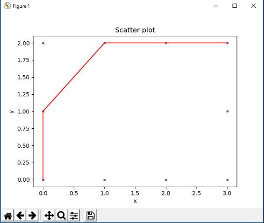

## Autonomous Navigation Using Node Based Pathfinding

**Project description:** This project, funded through the NASA Nebraska Space Grant, focused on being able to program an educational GoPiGo robot to navigate with existing GPS coordinates. The project started with self-guided learning of the python programming language in order to control the
robot. After that, the project involved creating a user interface and programming obstacle avoidance as well as node-based pathfinding. For the node-based pathfinding, I used [Dijkstra's Algorithm](https://en.wikipedia.org/wiki/Dijkstra%27s_algorithm) to find the shortest path from a theoretical starting point to an ending point.

**The GUI application of the algorithm**

One major challenge of this project was the organization of code. Due to this being my first major independent and educational project, I did not have enough knowledge about organization of my project. Since then, I have learned about creating class and folder structures for every project. However, I did make sure to comment and document my code. While documenting in general is one of the fundamentals of coding, it also helped me challenge myself to understand the code I was writing. This led to easier debugging and overall better understanding. 

**My very first application programmed from scratch**
![My very first application programmed from scratch]

What I learned the most from this project was that it gave me a different view of programming when compared to my college classes. For one, I had taught myself an entirely new language by myself, which is still my preferred programming language today. Secondly, while I had finished projects before, reporting, documenting and being responsible for your own work gave me another form of motivation which helped me improve my programming skills. I believe that this is one of the projects that introduced me to the challenges of programming and made me realize that this field was one I wanted to pursue. While it was certainly challenging, but I enjoyed the challenge of writing down my research and pseudocode until I fully understood how the algorithm worked.
